# Mind Trail

[Play the game here](https://steff657.github.io/hackathon-project/)

## Introduction

This project is a memory game where the player observes a highlighted path on a grid, memorises it, and then attempts to accurately reproduce the sequence. The game features adjustable path length settings, a timer to track completion speed, and an optional countdown toggle for time-limited challenges.

(Add "Am I responsive?" screenshot here)

## Design & Planning

### User Stories

[Read detailed User Stories in our project board](https://github.com/users/steff657/projects/5/views/1?layout=board)

## Wireframes

### Mobile

- Main game page

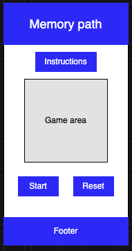

- instructions modal

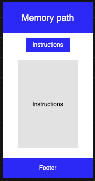

### Tablet

- Main game page

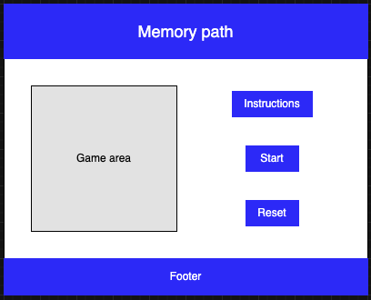

### Typography

The project uses a clean, modern sans‑serif font stack for maximum readability across devices and operating systems.

```
font-family: "Segoe UI", Tahoma, Geneva, Verdana, sans-serif;
```

### Colour Scheme

| Purpose             | Colour Code | Preview                                                   |
| ------------------- | ----------- | --------------------------------------------------------- |
| Background          | `#ffffff`   |  |
| Tile Color          | `#f0f0f0`   |  |
| Highlight (Correct) | `#4ecca3`   |  |
| Error (Incorrect)   | `#e94560`   |  |
| Text Colour         | `#333333`   |  |
| Panel Background    | `#e0e0e0`   |  |
| Wireframe           | `#2e31ff`   |  |

## Features

**Core Features:**

- A continuous path generated on the grid

  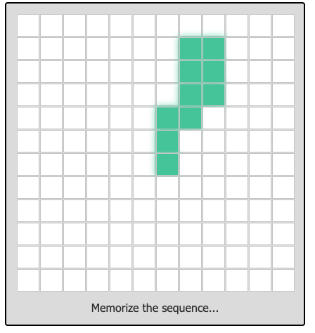

- The path is highlighted in sequence before the round begins and when it is the player's turn it disappears

  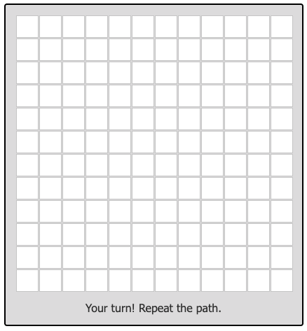

- Clear instructions on how to play the game

  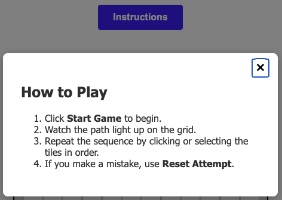

- Player reproduce the path by selecting tiles

  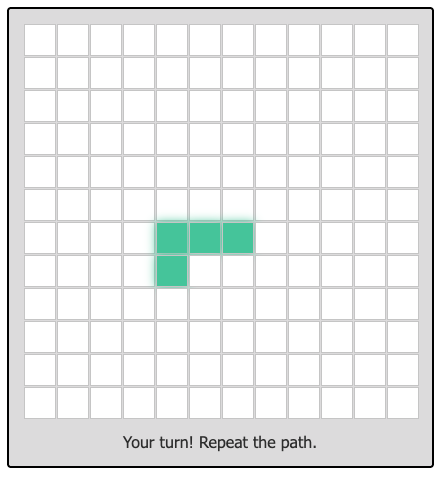

- Immediate success/failure feedback

  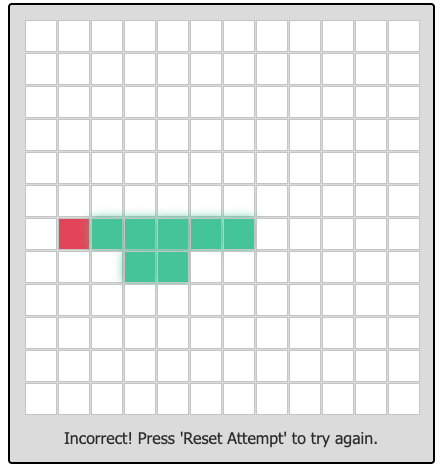

  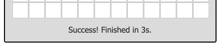

- Start and Reset buttons to control gameplay

  

- Single‑page layout with accessible structure and footer

  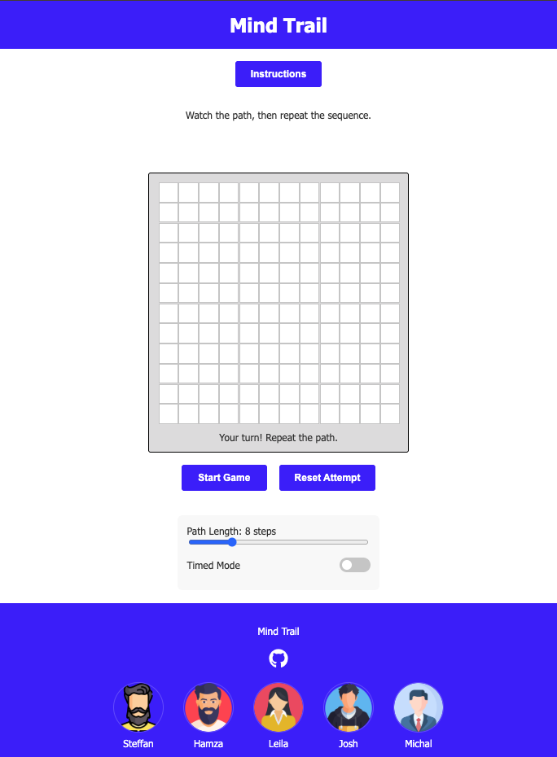

**Enhanced Features:**

- Optional timed mode with countdown

  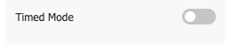

  

- Clear UI indicators for the game

  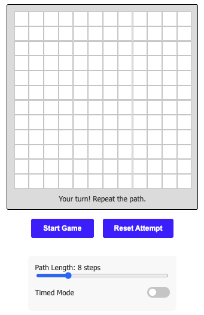

- Mobile‑friendly grid with reliable tap targets

  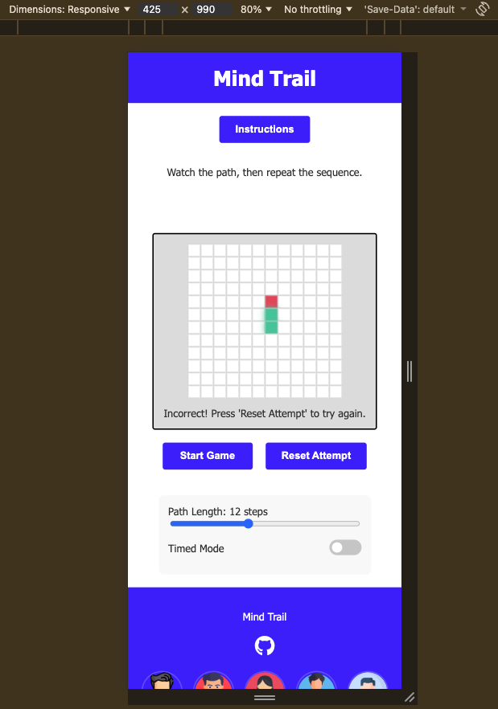

**Optional/ Future Features:**

- Difficulty levels
- Local high score storage
- Toggles for sound / animations
- Accessibility options: high‑contrast mode, keyboard navigation

## Technologies Used

- HTML
- CSS
- JavaScript
- Bootstrap 5

## Testing

### Google's Lighthouse Performance

Mobile


Desktop


### Responsiveness

### Browser Compatibility

### Manual Testing

### Code Validation

**HTML Validation:**

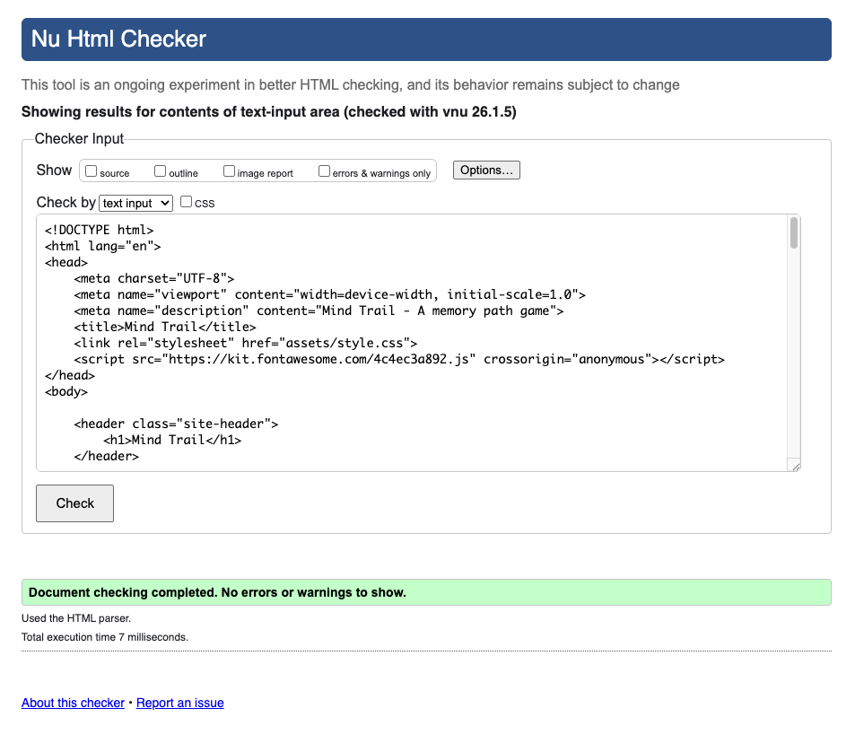

**CSS Validation:**

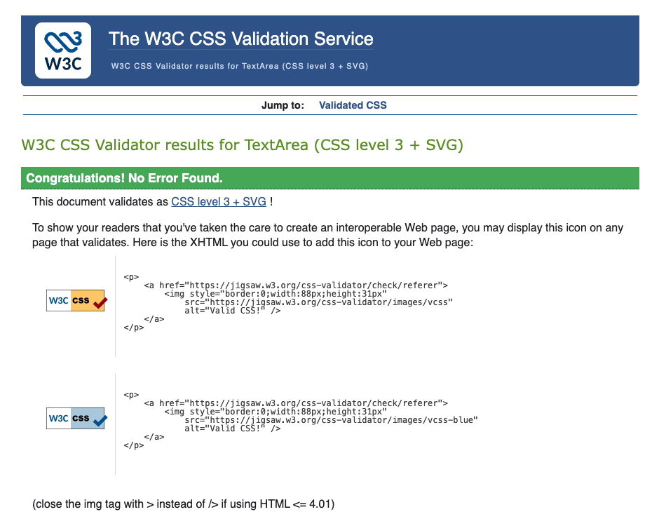

## Bugs

## Deployment

### Deploying on GitHub Pages

To publish this project live using GitHub Pages

    1. Push your project to a GitHub repository.
    2. Open the repository on GitHub.
    3. Go to Settings → Pages.
    4. Under Source, select: - Branch: `main` - Folder `/root`
    5. Click Save.
    6. Wait for GitHub Pages to build the site (usually under 1 minute).
    7. A live link will appear at the top of the Pages settings page.

    Your project is now deployed and publicly accessible

### Forking the Repository

If you want to create your own copy of this project on GitHub:

    1. Go to the repository page.
    2. Click the Fork button in the top‑right corner.
    3. GitHub will create a copy under your account.

### Cloning the Repository

If you want to download the project to your local machine:

    1. Click the Code button on the repository page.
    2. Copy the HTTPS or SSH link.
    3. Run the git clone command in your terminal

## Credits and Acknowledgements

### Wireframing

- Wireframes were created using **draw.io**  
  https://www.drawio.com/

### Development Support & Ideation

- **GitHub Copilot** and **ChatGPT** were used throughout development for coding assistance, debugging support, and generating and refining user story ideas.  
  https://github.com/features/copilot  
  https://chat.openai.com/

### Version Control

- **GitHub** was used for source control and project version management.  
  https://github.com/

### Icons

- Footer icons provided by **Font Awesome**  
  https://fontawesome.com/
- Avatar icons sourced from **Flaticon**  
  https://www.flaticon.com/free-icons/avatar

### Frontend Framework & Styling

- **Bootstrap** was used for layout and responsive design  
  https://getbootstrap.com/
- Custom styling implemented using **HTML** and **CSS**

### Validation & Testing

- **W3C HTML Validator**  
  https://validator.w3.org/
- **W3C CSS Validator**  
  https://jigsaw.w3.org/css-validator/

### Development Environment

- **Visual Studio Code (VS Code)** used as the primary IDE  
  https://code.visualstudio.com/

### Performance, Debugging & Responsiveness Tools

- **Google Chrome DevTools**  
  https://developer.chrome.com/docs/devtools/
- **Lighthouse**  
  https://developer.chrome.com/docs/lighthouse/
- **Am I Responsive** (ui.dev) – used to generate responsive project screenshots  
  https://ui.dev/amiresponsive

### Typography

- Fonts provided by **Google Fonts**  
  https://fonts.google.com/

### Project Assets

- All project screenshots and responsive layout images were captured and produced by the project author and collaborators.
